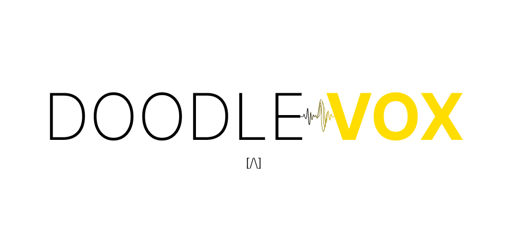
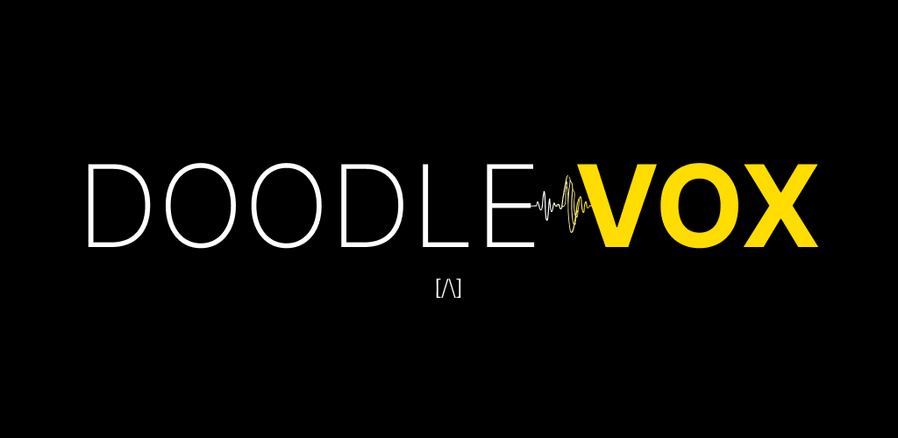

# DoodleVox

  
  

 

Easy voice-notes for music producers.
 

This parent repository is a small multi-target project containing two main components:
 

- [`doodlevox_mobile`](doodlevox_mobile) — a Flutter mobile app (Android & iOS) located in the `doodlevox_mobile/` folder. It contains the app source in `lib/`, platform folders (`android/`, `ios/`) and build/test configs.

- [`doodlevox_vst`](doodlevox_vst) — an audio plugin (C++/JUCE) located in the `doodlevox_vst/` folder. It contains CMake build files, source code, and plugin assets.
   

Each subfolder contains its own README and build instructions.

Start there for platform-specific setup.
