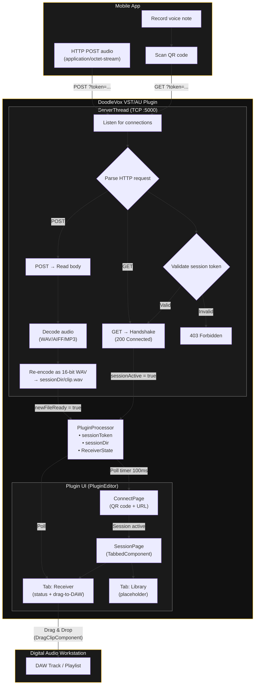

# DoodleVox (VST)

## Summary

The VST plugin acts as a **wireless audio receiver** inside a DAW. A companion mobile app (see `doodlevox_mobile`) records a voice note and streams the audio over Wi-Fi to the plugin, which saves the clip and lets the producer drag it straight onto a DAW track.

## Architecture Flowchart



## What's Been Implemented

### Build System (`CMakeLists.txt`)
- CMake project (`DoodleVox`, v0.0.3) targeting **Standalone**, **AU**, and **VST3** formats via JUCE 8.0.12.
- Cross-platform: macOS (universal binary `x86_64` + `arm64`, deployment target `10.13` / `11.0` arm64), Linux (WebKit2GTK), Windows (MSVC static runtime).
- `SharedCode` interface library for shared includes and compile definitions.
- `AudioPluginData` binary-data target bundling `assets/`.
- QR code generation via [nayuki/QR-Code-generator](https://github.com/nayuki/QR-Code-generator) v1.8.0 (fetched automatically by CPM).
- **Plugins are never auto-copied to system directories.** Distribution uses platform-native installers via CPack (macOS `.pkg`, Windows NSIS `.exe`, Linux `.deb`).
- Helper scripts: `xcode_setup.sh` (Xcode project generation), `package.sh` (one-command build + package).

### Session Management & TCP Server (`PluginProcessor`)
- On construction, generates a random **session token** (8-char hex via `juce::Uuid`) and creates a per-session temp directory (`DoodleVox_<token>/`).
- Spins up a background **`ServerThread`** listening on **TCP port 5000**.
- The server URL (including token) is encoded into a QR code: `http://<local-ip>:5000?token=<token>`.
- On each incoming connection the server:
  1. Reads the HTTP header byte-by-byte until `\r\n\r\n`.
  2. **Validates the session token** from the `?token=` query parameter — rejects with `403 Forbidden` if invalid.
  3. **GET** requests → handshake response (`200 Connected`), sets `sessionActive = true`.
  4. **POST** requests → reads `Content-Length` bytes into memory, decodes audio via `juce::AudioFormatManager` (WAV, AIFF, MP3, etc.), re-encodes as 16-bit WAV to `sessionDir/clip.wav` (overwriting any previous clip), responds `200 OK`, sets `newFileReady = true`.
- On destruction: stops server thread, **deletes the entire session directory** (all received clips removed).

### Plugin UI — Two-Page Architecture (`PluginEditor`)
The editor (380 × 500 px) switches between two top-level pages using a 100 ms polling timer:

#### Page 1: Connect (`ConnectPage`)
Shown on launch. Displays:
- **"DoodleVox"** title in gold.
- **QR code** encoding the server URL (with session token), rendered via `QRCodeComponent` + nayuki library.
- Instruction text and the raw URL for manual entry.

#### Page 2: Session (`SessionPage`)
Shown after a successful handshake (`sessionActive = true`). Contains a `juce::TabbedComponent` with:

| Tab | Component | Description |
|-----|-----------|-------------|
| **Receiver** | `ReceiverPage` | Status display (Idle → Receiving → Received → Ready to drag). Shows connection metadata. `DragClipComponent` appears when a clip is available. |
| **Library** | `LibraryPage` | Placeholder for future clip history (not yet implemented). |

The tab bar is designed to be extended with additional tabs (e.g., effects processing) in future versions.

#### Drag-and-Drop (`DragClipComponent`)
- Hidden until a clip is received; visible in the Receiver tab.
- Initiates a native **external drag-and-drop** of the WAV file via `juce::DragAndDropContainer::performExternalDragDropOfFiles`, allowing the clip to be dropped directly onto a DAW track.

### UI Theme: Midnight Sun
| Role | Colour | Usage |
|------|--------|-------|
| Primary | `#FFB800` (gold) | Titles, borders, active status, interactive accents |
| Secondary | `#FFFFFF` (white) | Primary text, ready-state labels |
| Tertiary | `#888888` (grey) | Secondary text, disabled/idle states |
| Neutral | `#000000` (black) | All backgrounds |

Sharp corners (0 roundedness) throughout. Dark-mode only.

### Source File Structure (`source/`)
```
source/
├── PluginProcessor.h/.cpp    — Audio processor, server thread, session management
├── PluginEditor.h/.cpp       — Top-level editor, page switching
├── ConnectPage.h/.cpp        — QR code connection page
├── SessionPage.h/.cpp        — Tabbed session container
├── ReceiverPage.h/.cpp       — Audio receiver status + drag-to-DAW
├── LibraryPage.h/.cpp        — Clip library placeholder
├── DragClipComponent.hpp/.cpp — Drag-and-drop file component
└── QRCodeComponent.h/.cpp    — QR code renderer (nayuki wrapper)
```

### Assets
- `assets/placeholder.txt` — reserves the `assets/` directory for the CMake binary-data target.

## Prerequisites

1. CMake (>= 3.23.1)
2. A C++17 toolchain (Xcode on macOS, MSVC on Windows, GCC/Clang on Linux)
3. JUCE modules are included in `modules/JUCE` (no separate download needed)
4. QR code library is fetched automatically via CPM

### Platform-specific extras

| Platform | Extra requirement |
|----------|-------------------|
| macOS | Xcode command-line tools (`xcode-select --install`) |
| Windows | [NSIS](https://nsis.sourceforge.io/) for building the installer |
| Linux | `libwebkit2gtk-4.0-dev`, `libasound2-dev`, `libfreetype6-dev` |

## Getting Started (Development)

1. Configure the project:

   ```bash
   cmake -S . -B build -DCMAKE_BUILD_TYPE=Debug
   ```

   For an Xcode project:

   ```bash
   cmake -S . -B build -G "Xcode"
   ```

2. Build:

   ```bash
   cmake --build build --config Debug
   ```

3. Build artefacts are written to `build/DoodleVox_artefacts/<config>/` and are **not** copied to system directories. You can run the standalone app directly from there:

   ```
   build/DoodleVox_artefacts/Debug/Standalone/DoodleVox.app    # macOS
   build/DoodleVox_artefacts/Debug/Standalone/DoodleVox        # Linux
   build/DoodleVox_artefacts/Debug/Standalone/DoodleVox.exe    # Windows
   ```

   To load the plugin in a DAW during development, point your DAW's plugin scan path at:
   - **VST3**: `build/DoodleVox_artefacts/Debug/VST3/`
   - **AU** (macOS): `build/DoodleVox_artefacts/Debug/AU/`

## Building Installers

DoodleVox uses **CPack** to produce platform-native installers so end-users can install to a location of their choice.

### Quick method — `package.sh`

```bash
./package.sh              # Release build (default)
./package.sh Debug        # Debug build
```

The script configures, builds, and packages in one step. Installers appear in `build_installer/`.

### Manual method

```bash
cmake -S . -B build_release -DCMAKE_BUILD_TYPE=Release
cmake --build build_release --config Release --parallel
cd build_release && cpack -C Release
```

### What gets generated

| Platform | Generator | Output | User can choose location? |
|----------|-----------|--------|---------------------------|
| macOS | `productbuild` | `.pkg` installer | Yes — install for current user or all users |
| Windows | `NSIS` | `.exe` installer | Yes — directory chooser dialog |
| Linux | `DEB` | `.deb` package | Installs to `/usr/lib/vst3` and `/usr/bin` |

### Default install locations (macOS `.pkg`)

| Component | Default path |
|-----------|-------------|
| VST3 | `/Library/Audio/Plug-Ins/VST3/DoodleVox.vst3` |
| AU | `/Library/Audio/Plug-Ins/Components/DoodleVox.component` |
| Standalone | `/Applications/DoodleVox.app` |

### Signing the macOS installer (optional)

```bash
cmake -S . -B build_release -DCMAKE_BUILD_TYPE=Release \
  -DCPACK_PRODUCTBUILD_IDENTITY_NAME="Developer ID Installer: Your Name (TEAMID)"
cmake --build build_release --config Release --parallel
cd build_release && cpack -C Release
```

## Using Visual Studio Code

1. Install the `CMake Tools` extension.
2. Open the workspace and let CMake configure (`CMake: Configure`).
3. Build via `CMake: Build` or run the Standalone target with `CMake: Run Without Debug`.

## macOS / Xcode

```bash
cmake -S . -B build -G "Xcode"
open build/DoodleVox.xcodeproj
```

The `xcode_setup.sh` script at the repo root automates this.

## Testing the Plugin

1. Build the project (see **Getting Started**).
2. Open a DAW (FL Studio, REAPER, Logic Pro, Ableton, etc.) and add the build artefact path to the DAW's plugin search directories, or build an installer and run it.
3. Insert **DoodleVox** on any track.
4. The QR code page appears — scan with the companion mobile app.
5. After the handshake, the Receiver tab shows connection status.
6. Record and send audio from the mobile app.
7. Drag the received clip onto a DAW track.

## License

This project is licensed under the **GNU Affero General Public License v3.0 (AGPL-3.0)**

This means:
- You are free to use, modify, and distribute this software.
- Any modifications you distribute **must** also be released under AGPL-3.0.
- If you run a modified version on a **network server**, you must make the modified source code available to users of that server.

For the full license text, see [LICENSE.txt](LICENSE.txt) or https://www.gnu.org/licenses/agpl-3.0.html.
